# React Native News Project:

# A) About:

A project that displays news from the Hacker News API

https://react-native-news-project-132068024308.europe-west1.run.app/ (But I'll take down the deployment after a few weeks, so that I don't keep paying the server)

# B) Technologies Used:

- React Native
- React
- TypeScript
- Expo
- NativeWind
- Redux
- React Query
- AsyncStorage
- React Native Reanimated
- Docker
- Google Cloud

# C) Features:

## C-1) Placeholder Auth:

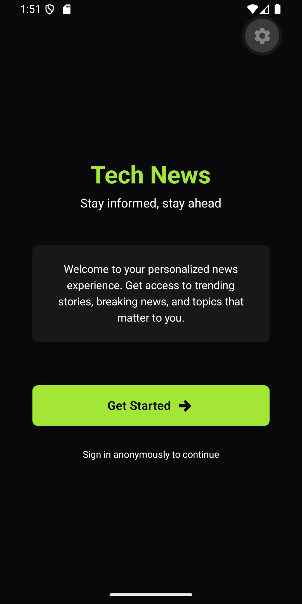

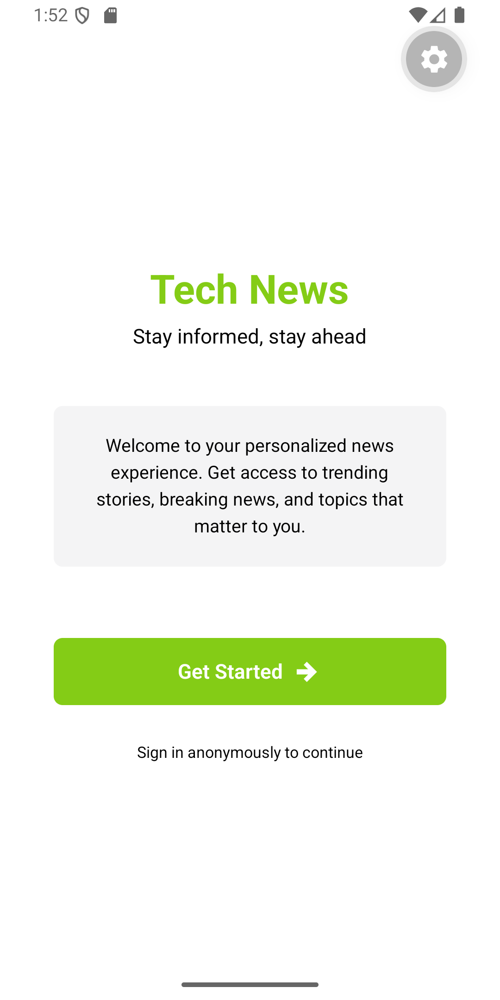

- Just to prepare for the authentication, when it's time to connect to backend Auth
- There is a login screen, the user can't access the app unless if he is logged in
- Logging in is persistent with AsyncStorage, and initialized on app open
- ALso, in the settings screen, there is the ability to log out

## C-2) Home Screen:

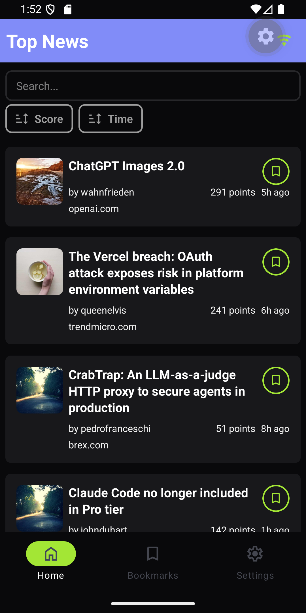

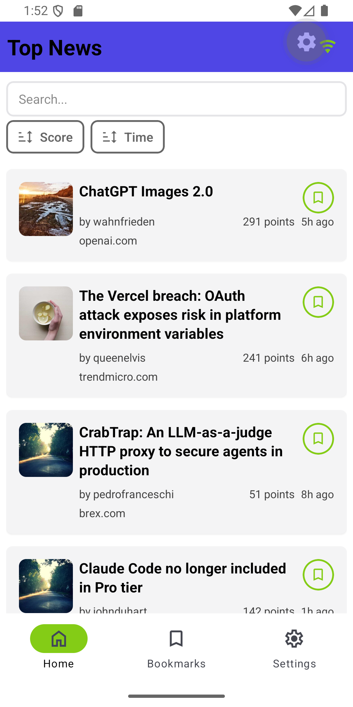

- The home screen displays a list of he news cards
- Each card contains the information about it
  - Random image
  - Title
  - Who posted it
  - Points number
  - Time of posting
  - The domain name (example: github.com)
  - A button to add the news to the bookmarks, or remove it from the bookmarks
    - The button also tells if this news is added to the bookmarks or not, if the bookmark icon is filled, then it's added, if outlined, then it's not added
- The ability for sort and search (To be discussed in another section)
- The ability to Pull to refresh

## C-3) News Detail Screen:

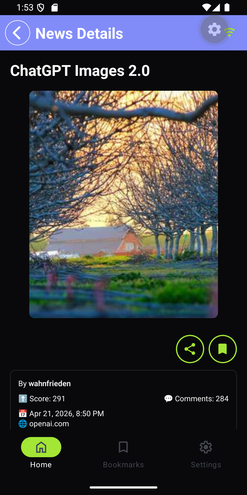
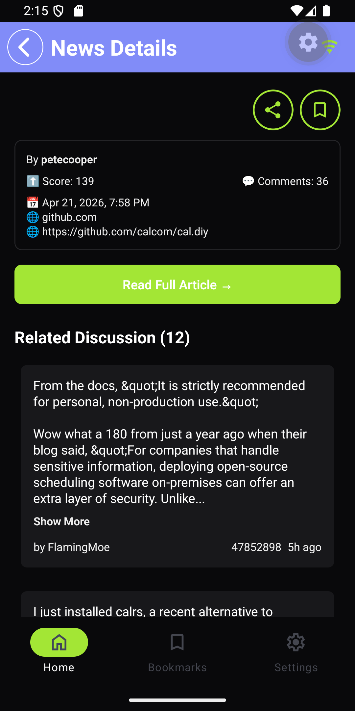

- In the home screen, when we press on a news card, we are taken to the News Details screen
- This screen contains the following
  - The ability to go back (And of course it maintains the state of the previous screen, and doesn't affect it)
  - Title of the news
  - The random image
  - The sharing button
  - The ability to add to the bookmarks, or to remove from the bookmarks
  - Who created it
  - Score
  - Number of comments
  - Posting date
  - Website
  - News Link URL
  - A button to take us to the article (using the browser)
  - Filtered Comments on the article

## C-4) Bookmarks Screen:

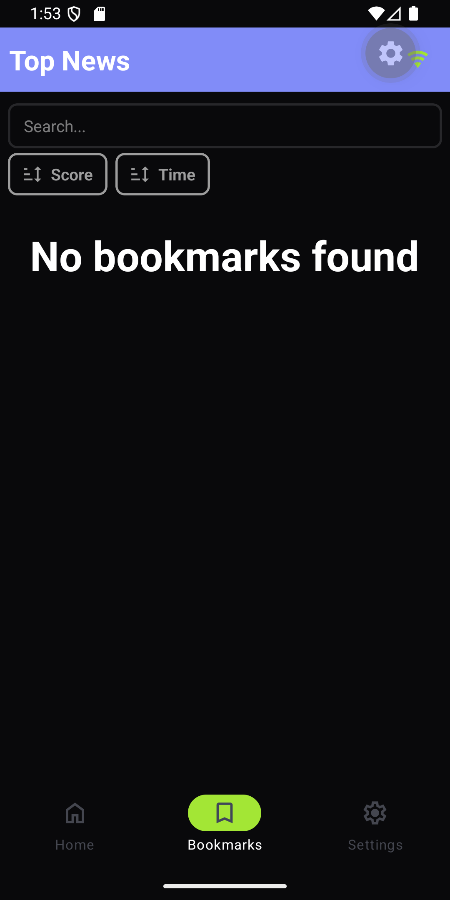

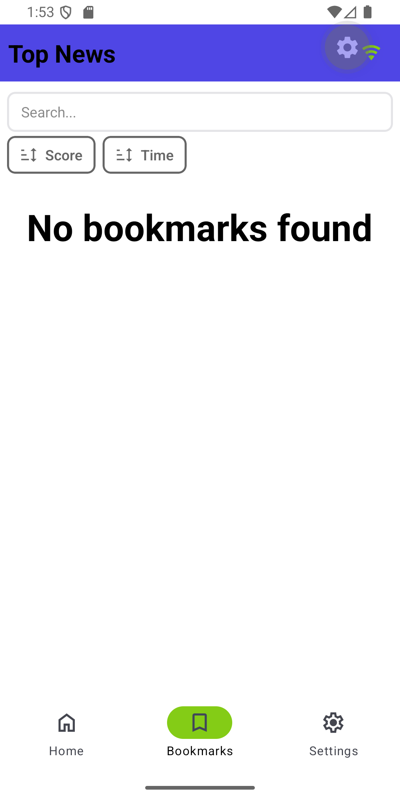

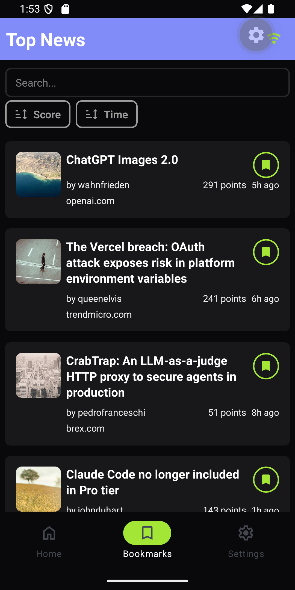

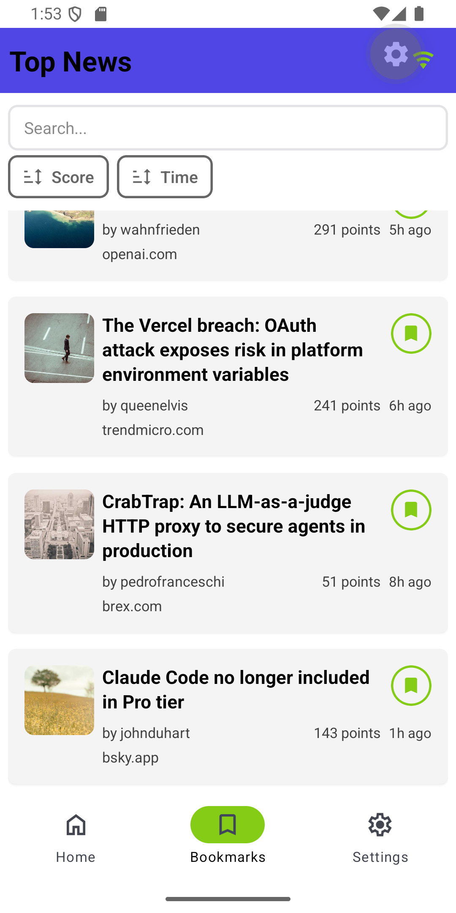

- The screen that contains the bookmarked news, as a list of cards
- If no bookmarks are available, it says: "No bookmarks found"
- If there are bookmarked news, it displays them as cards
- The ability to remove items from the bookmarks
- The ability to search and sort (To be discussed in the next section)

## C-5) Searching and Filtering:

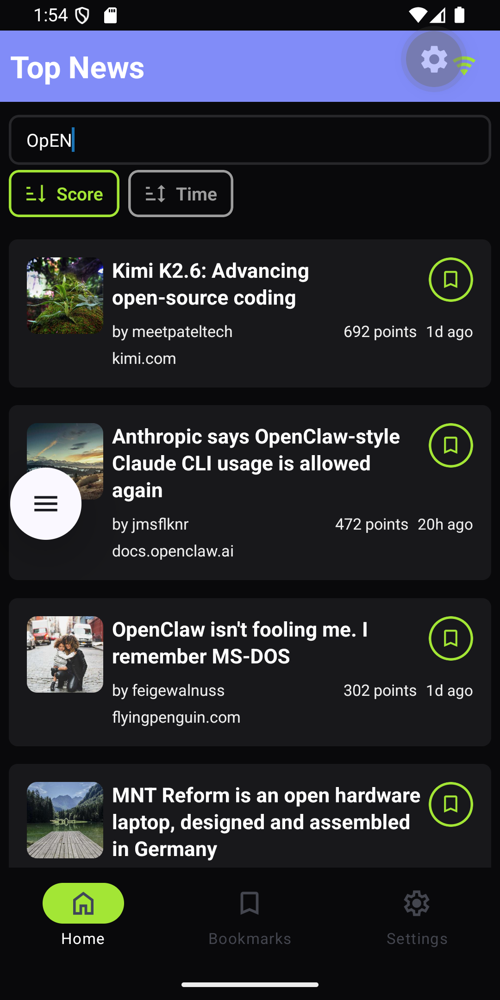

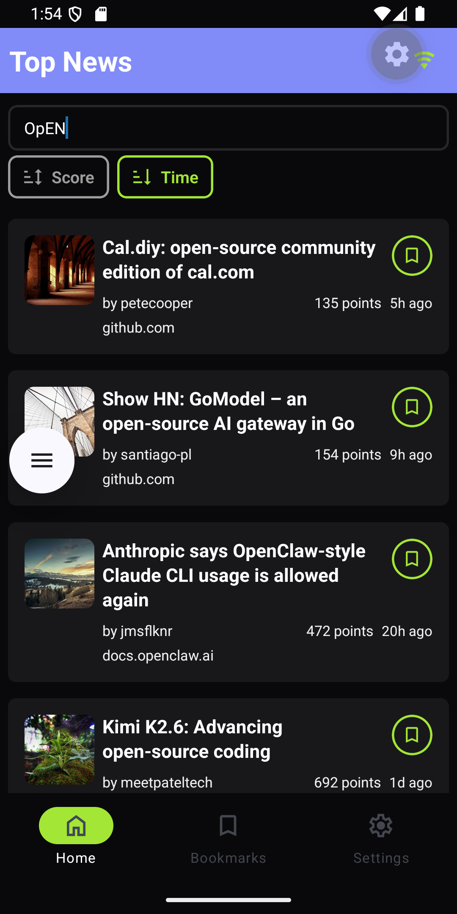

- This is available in 2 screens
  - Home screen
  - Bookmarks screen
- Search:
  - By text
  - Not case sensitive
- Sorting by Score:
  - None
  - Ascending
  - Descending
- Sorting by Time:
  - None
  - Ascending
  - Descending
- Note: you can't sort by Time and Score at the same time, you either sort by Time or by Score

## C-6) Sliding the bookmark in the bookmarks screen:

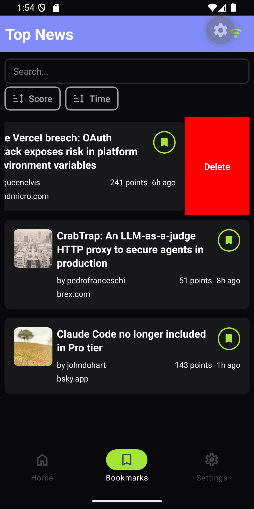

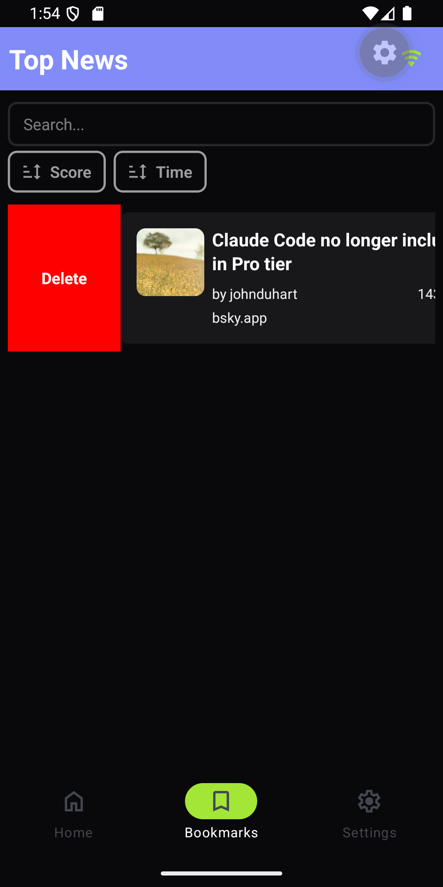

- Sliding the bookmark right or left, deletes the bookmarked news

## C-7) Light and Dark Themes:

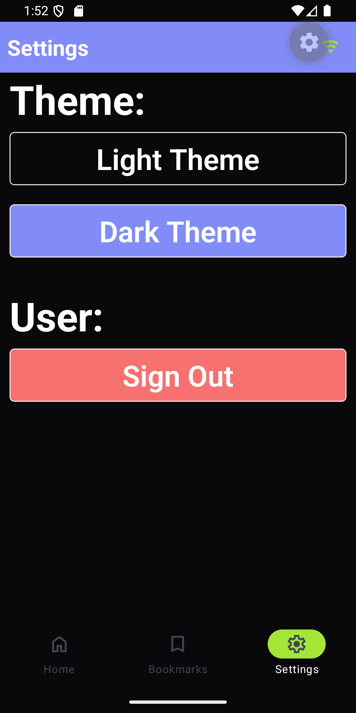

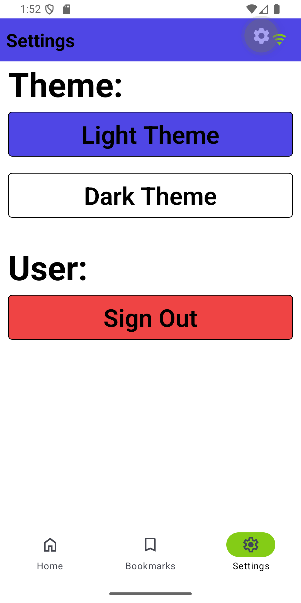

- This is persistent, and is initialized on app open

## C-8) Cross Platform:

- It runs on:
  - Android
  - iOS
  - Web: https://react-native-news-project-132068024308.europe-west1.run.app/ (But I'll take down the deployment after a few weeks, so that I don't keep paying the server)

## C-9) Offline detection banner:

- Available in the header

## C-10) Testing:

- Added test case
